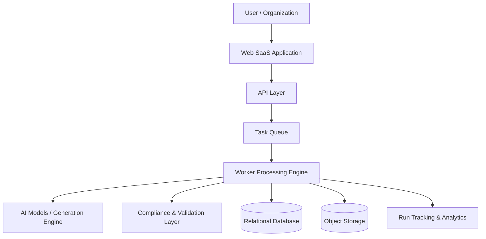

# DICOS — Domain Intelligence Content Operating System

DICOS is a multi-tenant SaaS platform designed for generating **domain-aware, policy-constrained content across multiple channels**.

The system is designed to support structured content generation workflows that combine domain knowledge, AI orchestration pipelines, and compliance validation layers.

---

# Project Overview

The goal of DICOS is to enable organizations to generate high-quality content that adheres to domain-specific rules, tone requirements, and compliance constraints.

Instead of relying on generic AI prompts, DICOS introduces structured **Domain Intelligence Packs (DIPs)** that guide the AI generation process.

---

# Core System Components

## System Architecture Diagram

The platform architecture consists of several layers:

### SaaS Frontend

User-facing interface built for managing workspaces, generation runs, and domain configurations.

### API Layer

Handles authentication, orchestration requests, workspace management, and generation coordination.

### Worker Pipeline

Processes generation tasks asynchronously using queue-based workers.

### Domain Intelligence Packs (DIPs)

Structured domain knowledge used to guide AI generation workflows.

### Compliance and Validation Layer

Ensures generated content meets domain-specific policy constraints.

---

# Architecture Overview

The system architecture includes:

* multi-tenant SaaS workspace model
* AI generation orchestration pipeline
* asynchronous worker infrastructure
* structured domain knowledge packs
* compliance validation systems

---

# Implementation Status

The platform is currently under active development.

Based on internal engineering documentation, the system is estimated to be approximately:

**~74% complete**

Major architectural components are already implemented, with remaining work focused on product surface expansion and production hardening.

---

# Documentation

Architecture documentation for this system:

* [Project Overview](PROJECT_OVERVIEW.md)
* [External Architecture Overview](ARCHITECTURE_OVERVIEW_FOR_EXTERNALS.md)
* [System Architecture](SYSTEM_ARCHITECTURE.md)
* [Repository Structure](REPO_STRUCTURE.md)
* [Product Capabilities](PRODUCT_CAPABILITIES.md)
* [Development Workflow](DEVELOPMENT_WORKFLOW.md)
* [Implementation Status](IMPLEMENTATION_STATUS.md)
* [Project Completion Estimate](PROJECT_COMPLETION_ESTIMATE.md)

---

# Focus Areas

DICOS demonstrates capabilities in:

* AI product architecture
* AI orchestration systems
* multi-tenant SaaS design
* AI-assisted software development
* domain-aware AI systems
